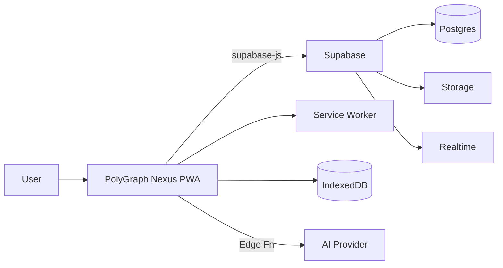
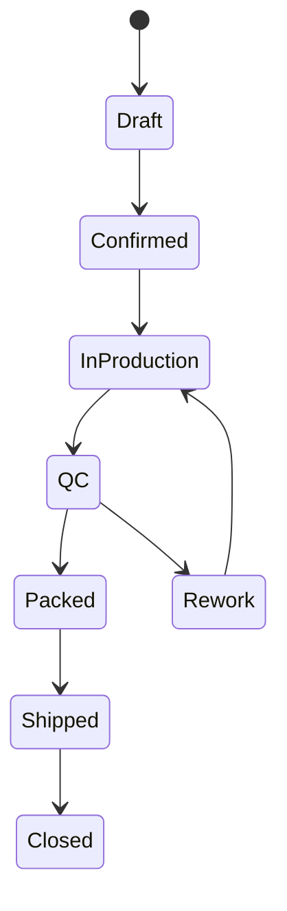

# ARCHITECTURE — техническая архитектура

> Цель: описать, как будет выглядеть система **после реализации**, чтобы мы кодили последовательно и не ломали фундамент.

## 1) Высокоуровневый обзор

PolyGraph Nexus = **PWA клиент** + **Supabase backend**.

- Клиент (React/TS/Vite):
  - UI, роутинг, состояния
  - оффлайн-кэш (IndexedDB)
  - доступ к Supabase (auth/db/storage/realtime)
  - интеграция AI (через Edge Functions или отдельный сервис)

- Supabase:
  - PostgreSQL (основные таблицы)
  - Auth (пользователи/сессии/провайдеры)
  - Storage (файлы)
  - Realtime (подписки на изменения)
  - Edge Functions (серверная логика, вебхуки, AI прокси)

Supabase рекомендует локальную разработку через CLI + миграции, а затем пушить изменения в облако. citeturn0search0turn0search14turn0search2

## 2) Слои приложения (Layered Architecture)

### 2.1. Presentation Layer (UI)
- Routes / Pages
- Components
- UI state (local UI)
- Form validation

### 2.2. Application Layer (Use cases)
- Оркестрация действий пользователя:
  - создание заказа
  - назначение исполнителя
  - смена статуса
  - резервы материалов
  - публикация сообщения в чате
- Содержит бизнес‑сценарии (без SQL)

### 2.3. Domain Layer (Core)
- Сущности: Order, Task, RoutingStage, Material, Reservation
- Инварианты:
  - нельзя закрыть заказ без QC
  - нельзя списать материал, если резерв «заморожен»
  - этапы маршрута должны быть связаны и иметь порядок

### 2.4. Infrastructure Layer
- Supabase client (db/auth/storage)
- Realtime subscriptions
- Local cache (IndexedDB)
- Edge functions (server side)

## 3) Offline-first стратегия

### 3.1. Что именно оффлайн
MVP реалистично:
- список заказов (последние N)
- задачи исполнителя (мои задачи)
- базовые справочники (сектора, статусы)
- черновики сообщений/комментариев

### 3.2. Как
- IndexedDB как локальное хранилище
- Service Worker:
  - кэш ассетов (shell)
  - кэш API ответов (по стратегии: stale‑while‑revalidate)
- конфликт‑резолвинг:
  - optimistic UI + server подтверждение
  - при конфликте — «версия/updated_at» и merge

> Плагин Vite PWA позволяет быстро включить PWA‑режим и service worker на базе Workbox. citeturn0search20

## 4) Auth и роли

- Supabase Auth (email/password, OAuth провайдеры при необходимости)
- Роли в Postgres:
  - anon
  - authenticated
  - service_role (только сервер, нельзя в клиент)
- RLS policies:
  - пользователь видит только свои организации/площадки/заказы по membership
  - менеджер видит всё в пределах org
  - исполнитель видит назначенные ему задачи

Пояснение по ключам:
- **anon key** допустим в браузере при корректном RLS citeturn0search6turn0search17
- **service role key** хранится только на сервере (Edge Functions/CI) citeturn0search17

## 5) Realtime

Используем подписки на:
- orders (изменение статуса/дедлайна/назначений)
- tasks (перемещение по канбану)
- chat_messages (новые сообщения)

UX‑задача: «обновления не должны бесить» — делаем аккуратные toast/бейджи.

## 6) Storage: файлы и превью

Храним:
- макеты (pdf/ai/psd)
- превью (webp/png)
- фото брака / фото упаковки
- документы (счёт, акт)

Подход:
- в таблице attachments хранить:
  - bucket, path, mime, size, created_at
  - связку (order_id/task_id/chat_thread_id)
- выдача ссылок:
  - подписанные URL (если приватно)
  - публичные (если можно)

## 7) AI‑слой (Dev Sandbox)

Задачи AI:
- генерировать шаблоны UI (формы, таблицы)
- подсказки по маршрутизации заказа
- авто‑создание чеклистов QC
- авто‑разбор входящих файлов/описаний заказа

Архитектурно:
- клиент вызывает Edge Function `/functions/v1/ai/*`
- функция проксирует запрос к модели (DeepSeek/OpenAI/другая)
- логируем запросы/ответы (для дебага и стоимости)

## 8) Диаграммы (черновые)

### 8.1. System Context (упрощённо)

### 8.2. Order lifecycle (упрощённо)

